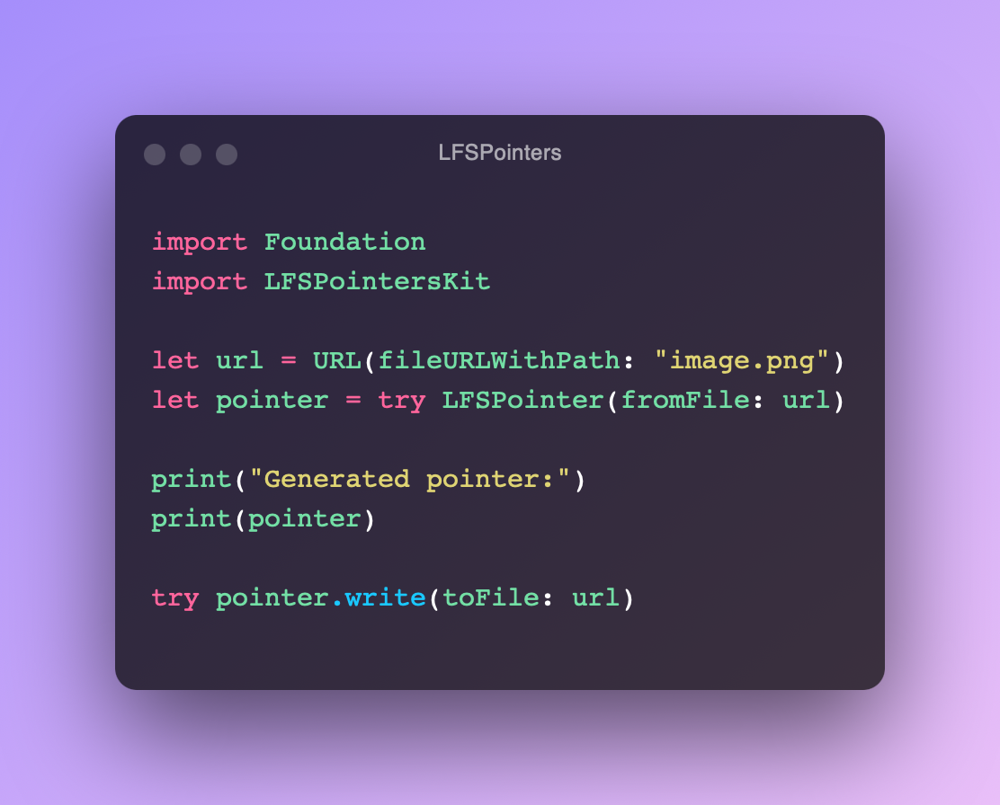

# LFS Pointers

**A Swift library and CLI that allows you to convert a Git repository directory of large files to Git LFS pointers.**



[](https://swift.org)
[](https://swift.org/package-manager)
[](https://img.shields.io/badge/Platforms-MacOS%20%7C%20Linux-lightgrey)
[](https://github.com/LebJe/LFSPointers/releases)
[](https://github.com/LebJe/LFSPointers/actions?query=workflow%3A%22Build+and+Test%22)
[](https://github.com/LebJe/LFSPointers/actions?query=workflow%3A%22Build+Container%22)

Table of Contents
=================

<!--ts-->
   * [LFS Pointers](#lfs-pointers)
   * [Table of Contents](#table-of-contents)
      * [Install Program](#install-program)
         * [<a href="https://github.com/yonaskolb/mint">Mint</a>](#mint)
         * [<a href="https://brew.sh" rel="nofollow">Homebrew</a>](#homebrew)
         * [From DEB or RPM](#from-deb-or-rpm)
            * [DEB](#deb)
            * [RPM](#rpm)
         * [Manually](#manually)
            * [Build Using <a href="https://www.docker.com" rel="nofollow">Docker</a>](#build-using-docker)
               * [Ubuntu 16.04](#ubuntu-1604)
               * [Ubuntu 18.04](#ubuntu-1804)
               * [Ubuntu 20.04](#ubuntu-2004)
               * [CentOS 8](#centos-8)
            * [Build Without Docker](#build-without-docker)
            * [Build on Windows](#build-on-windows)
         * [From GitHub Release](#from-github-release)
         * [Setup Shell Completions](#setup-shell-completions)
            * [ZSH](#zsh)
               * [Oh My ZSH](#oh-my-zsh)
               * [Without Oh My ZSH](#without-oh-my-zsh)
            * [Bash](#bash)
      * [Install Library](#install-library)
         * [Swift Package Manager](#swift-package-manager)
      * [Usage](#usage)
         * [Library](#library)
            * [Import](#import)
            * [File Conversion](#file-conversion)
            * [Folder Conversion](#folder-conversion)
            * [Writing Pointers](#writing-pointers)
            * [Generating JSON](#generating-json)
         * [Command Line](#command-line)
      * [Dependencies](#dependencies)
      * [More Information](#more-information)
      * [Tested Platforms](#tested-platforms)
         * [Mac](#mac)
         * [Linux](#linux)
         * [iOS](#ios)
         * [Windows](#windows)
      * [JSON Structure for LFSPointer Array](#json-structure-for-lfspointer-array)
      * [JSON Structure for Single LFSPointer](#json-structure-for-single-lfspointer)
      * [Install <a href="https://swift.org/download/" rel="nofollow">Swift</a>](#install-swift)
         * [Linux (aarch64)](#linux-aarch64)
            * [Ubuntu](#ubuntu)
      * [Contributing](#contributing)

<!-- Added by: jefflebrun, at: Sat Feb  6 23:44:23 EST 2021 -->

<!--te-->
Created by [gh-md-toc](https://github.com/ekalinin/github-markdown-toc)

It it recommended that you read the [Git-LFS Homepage](https://git-lfs.github.com) before continuing.

## Install Program

### [Mint](https://github.com/yonaskolb/mint)

```bash
$ mint install LebJe/LFSPointers
```

### [Homebrew](https://brew.sh)

```bash
$ brew install LebJe/formulae/lfs-pointers
```

If you would like to install from `HEAD` then make sure `swift --version` succeeds ([Install Swift](#Install-Swift) otherwise) then run:

```bash
$ brew install LebJe/formulae/lfs-pointers --HEAD
```

### From DEB or RPM

#### DEB

```bash
curl -s https://packagecloud.io/install/repositories/LebJe/LFSPointers/script.deb.sh > script.sh
chmod +x script.sh
sudo os=ubuntu dist=focal ./script.sh
sudo apt install lfspointers
```

#### RPM

```bash
curl -s https://packagecloud.io/install/repositories/LebJe/LFSPointers/script.rpm.sh > script.sh && chmod +x script.sh
sudo os=fedora dist=32 ./script.sh
sudo yum install LFSPointers
```

### Manually

#### Build Using [Docker](https://www.docker.com)
If you are on Ubuntu 16.04, 18.04, 20.04, or CentOS 8, you can build `LFSPointers` using:

##### Ubuntu 16.04

```bash
$ docker run --rm -v $(pwd):/src -w /src swift:xenial swift build -c release --enable-test-discovery --static-swift-stdlib -Xswiftc -static-executable
````

##### Ubuntu 18.04

```bash
$ docker run --rm -v $(pwd):/src -w /src swift:bionic swift build -c release --enable-test-discovery --static-swift-stdlib -Xswiftc -static-executable
````

##### Ubuntu 20.04

```bash
$ docker run --rm -v $(pwd):/src -w /src swift:focal swift build -c release --enable-test-discovery --static-swift-stdlib -Xswiftc -static-executable
````

##### CentOS 8

```bash
$ docker run --rm -v $(pwd):/src -w /src swift:centos8 swift build -c release --enable-test-discovery --static-swift-stdlib -Xswiftc -static-executable
````

Then run `mv .build/release/LFSPointers .` to move the binary to your current
directory.


#### Build Without Docker

If you don’t or can’t use Docker, you can [Install Swift](#Install-Swift), then run:

```bash
$ swift build -c release
```

The binary will be located at `/path/to/LFSPointers/.build/release/LFSPointers`.

#### Build on Windows

[Install Swift](#Install-Swift), open `Windows Powershell`, navigate to the directory that contains `LFSPointers`, and run:

```powershell
swift build -Xswiftc -sdk -Xswiftc $env:SDKROOT
```

the executable will be located at `C:\path\to\LFSPointers\.build\release\LFSPointers.exe`.

### From GitHub Release

Simply download the release asset. The binary is statically linked, so there is no need to install additional software.

### Setup Shell Completions

#### ZSH

##### Oh My ZSH

Create a file called `~/.oh-my-zsh/completions/_LFSPointers`, then run:

```zsh
% LFSPointers --generate-completion-script zsh > ~/.oh-my-zsh/completions/_LFSPointers
```
##### Without Oh My ZSH
Add 

```zsh
fpath=(~/.zsh/completion $fpath)
autoload -U compinit
compinit
```

to your `.zshrc`, then create `~/.zsh/completion`, and run:

```zsh
% LFSPointers --generate-completion-script zsh > ~/.zsh/completion/_LFSPointers
```

#### Bash

Create a directory to store Bash completions, (`~/.bash_completions/`), and add this to your `.bashrc` or `.bash_profile`:

```bash
source ~/.bash_completions/LFSPointers.bash
```

, then run:
```bash
$ LFSPointers --generate-completion-script bash > ~/.bash_completions/LFSPointers.bash
```

## Install Library
### Swift Package Manager
Add this to the `dependencies` array in `Package.swift`:

```swift
.package(url: "https://github.com/LebJe/LFSPointers.git", from: “4.0.0”)
```
. Also add this to the `targets` array in the aforementioned file:

```swift
.product(name: "LFSPointersKit", package: "LFSPointers")
```

## Usage
### Library
#### Import
```swift
import LFSPointersKit
```

#### File Conversion
To convert a file to a pointer you could write:

```swift
let pointer = try LFSPointer(fromFile: URL(fileURLWithPath: "path/to/file"))
```

The pointer is represented as a Swift `struct`.

```swift
public struct LFSPointer {
	/// The version of the pointer. Example: "https://git-lfs.github.com/spec/v1".
	public let version: String

	/// An SHA 256 hash for the pointer.
	public let oid: String

	/// The size of the converted file.
	public let size: Int

	/// The name of the file.
	public let filename: String

	/// The full path of the file.
	public let filePath: String
	
	/// String representation of this pointer.
	public var stringRep: String
	...
}
```

#### Folder Conversion

To convert a folder of files to pointers, you could write: 

```swift
let pointers = try LFSPointer.pointers(forDirectory: URL(fileURLWithPath: "path/to/folder"), searchType: .filenames(["foo.java", "bar.js", "baz.py"]))
```

The search types available are:

```swift
// Array of filenames.
.fileNames(["foo.java", "bar.js", "baz.py"])

// Regular expression.
.regex(NSRegularExpression(pattern: "^*.swift$"))

// All files.
.all
```

That function returns an array of `LFSPointer`s.

#### Writing Pointers
After you generate a pointer, write it to a file using:

```swift
let pointer = try LFSPointer(...)
try pointer.write(toFile: URL(fileURLWithPath: "path/to/file"), shouldAppend: false)
```

#### Generating JSON
To convert a pointer to JSON:

```swift
let pointer = try LFSPointer(...)
try JSONEncoder().encode(pointer)
```

and to convert an array of `LFSPointer`s:

```swift
let pointers = try LFSPointer.pointers(...)
JSONEncoder().encode(pointers)
```

The JSON for the `LFSPointer` array will be structured as shown [here](#json-structure-for-lfspointer-array), and the JSON for the single `LFSPointer` will be structured as shown [here](#json-structure-for-single-lfspointer).

### Command Line
If you want to use [the Docker image](https://github.com/users/LebJe/packages/container/package/lfs-pointers), prefix all the following commands with: `docker run --rm -v $(pwd):/src -w /src ghcr.io/lebje/lfs-pointers:latest <command>`

Let's imagine you have a directory of large `png` and `jpg` files called `Project Logos`. If you wanted to convert the files with the extension `png` to LFS pointers, you could run 

```bash
$ LFSPointers path/to/Project\ Logos path/to/Project\ Logos/*.png
```

. The first argument is the path to the directory, and the second argument is a regular expression used to search for `png` files that your shell will convert to a list of filenames.\
But wait! It's not safe to run random programs on your computer! To backup your files just in case something goes wrong, add `-b path/to/backup-directory` to the previous command, like this:

```bash
$ LFSPointers -b path/to/backup-directory path/to/Project\ Logos path/to/Project\ Logos/*.png
```

If you want to generate JSON output instead, run:

```bash
$ LFSPointers --json path/to/Project\ Logos path/to/Project\ Logos/*.png
```

The JSON will be structured as shown [here](#json-structure-for-lfspointer-array).

## Dependencies

- [Files](https://github.com/JohnSundell/Files)
- [Rainbow](https://github.com/onevcat/Rainbow)
- [Swift Argument Parser](https://github.com/apple/swift-argument-parser)
- [swift-crypto](https://github.com/apple/swift-crypto)

## More Information
Run `LFSPointers --help`.

## Tested Platforms

### Mac
Tested on MacOS 10.15 and 11, using Swift 5.2 and 5.3.
### Linux
Tested on Ubuntu 18.04 (`x86_64` and `aarch64`), also using Swift 5.2 and 5.3.
### iOS
This project has not been tested on iOS yet, although, at the time of writing the sample project in `Samples/FileToPointer` is currently working.
### Windows
`LFSPointers` is currently being built and tested on Windows, but there are a few problems:
* Windows paths are converted to UNIX paths: `C:\Users\user\file` => `C:/Users/user/file`

## JSON Structure for LFSPointer Array

```json
[
	{
		"version": "https://git-lfs.github.com/spec/v1",
		"oid": "10b2cd328e193dd4b81d921dbe91bda74bda704c37bca43f1e15f41fcd20ac2a",
		"size": 1455,
		"filename": "foo.txt",
		"filePath": "/path/to/foo.txt"
	},
	{
		"version": "https://git-lfs.github.com/spec/v1",
		"oid": "601952b2d85214ea602104a4784728ffa6b323b3a6131a124044fa5bfc2f7bf2",
		"size": 1285200,
		"filename": "bar.txt",
		"filePath": "/path/to/bar.txt"
	}
]
```

## JSON Structure for Single LFSPointer

```json
{
	"version": "https://git-lfs.github.com/spec/v1",
	"oid": "10b2cd328e193dd4b81d921dbe91bda74bda704c37bca43f1e15f41fcd20ac2a",
	"size": 1455,
	"filename": "foo.txt",
	"filePath": "/path/to/foo.txt"
}
```


## Install [Swift](https://swift.org/download/)

[Download Swift](https://swift.org/download/), then follow the instructions for your platform:

- [Mac](https://swift.org/download/#apple-platforms)
- [Linux](https://swift.org/download/#linux)
- [Windows](https://swift.org/download/#windows)


### Linux (`aarch64`)

More information at [swift-arm64](https://github.com/futurejones/swift-arm64).

#### Ubuntu

```bash
$ curl -s https://packagecloud.io/install/repositories/swift-arm/release/script.deb.sh | sudo bash
sudo apt install swiftlang
```

## Contributing
Before committing, please install [pre-commit](https://pre-commit.com), and [swift-format](https://github.com/nicklockwood/SwiftFormat) and install the pre-commit hook:
```bash
$ brew bundle # install the packages specified in Brewfile
$ pre-commit install

# Commit your changes.
```

To install pre-commit on other platforms, refer to the [documentation](https://pre-commit.com/#install).
